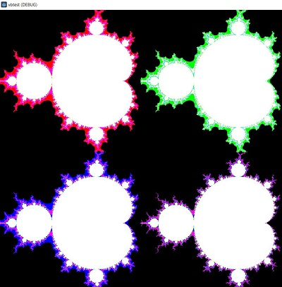

# GodotVisualBasic_example_benchmark_mandelbrot     
benchmark painting a mandelbrot with gdscript, VisualBasic and C#.

results on my old PC:    
VisualBasic - 153 ms    
C# - 149 ms    
gdscript - 4597 ms    
so VisualBasic is as fast as C#, but 30times faster than gdscript! And its compiled and you can leave your sources safe.    

gdscript(red), VisualBasic(green), C#(blue):    

